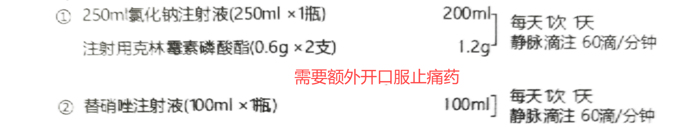

# 注意事项

## 治疗前

- 一定要有DR医学影像作为依据
  - 脊柱全景正侧位，条件不具备则拍“颈椎、胸椎和腰椎正侧位 + 骨盆平片”
  - 患处正侧位，如膝关节不适则拍“膝关节正侧位”
  - 若为耳聋、情志不畅则拍“颈椎张口位”
- 晕针预防：空腹，低血糖，精神紧张，怕针者以上情况综合分析逐一排除，心理疏导
- 凝血四项+过敏皮试（利多卡因、青霉素、干扰素、前列地尔等）
- 操作前进行外科消毒
  - 消毒顺序为从头侧到脚侧，先清洁区再污染区，消毒次数为三遍以上，每次消毒不留空隙。
  - 完成后务必用无菌纱布盖住进针点，防止污染。
- 消毒完成后，穿一次性手术衣，带无菌手套，铺无菌洞巾，进行手术区麻醉（胸骨柄和颈7以上不打麻药）。

## 治疗中

- 严格注意无菌操作，一点一针，禁止重复使用针具
- 一只手进行操作时，另一只手必须用于稳定针体
- 保持针柄、针体和骨面在同一垂线上，落空即止
- 禁止生拉硬拽，来回撬拨，严禁用锤子暴力敲击针尾
- 在操作中发现针有弯曲应停止操作，避免断针
- 进针时间2分钟左右为佳，操作时间过长应换新针具
- 血清用于脊柱区域皮下注射或穴位注射
- 除耻骨和股骨头血清回注5毫升以上，其余部位不回注血清
- 回注时使用生理盐水封管

## 三氧冲洗和封管注意事项

1. 原来使用三氧气直接冲洗和封管的做法现已改为：
     - 三氧小自血冲洗
     - 生理盐水封管

2. 三氧小自血冲洗使用方法
     1. 选用30~50毫升注射器。
     2. 取25%至40微克每毫升三氧气体，量为10~20毫升。
     3. 在针刺部位抽取10~20毫升骨内血。
     4. 将三氧气体与骨内血充分摇匀。
     5. 摇匀后排出三氧气体。
     6. 在同一部位回注骨内血。
     7. 通过反复抽吸实现三氧小自血冲洗的目的。

3. 三氧小自血冲洗的禁忌
     - 第一腰椎以上的部位不得使用三氧小自血冲洗。
     - 腰部以下的部位可以使用三氧小自血冲洗。

4. 封管推荐方法
     - 任何部位均不得使用三氧封管
     - 推荐使用3~5毫升生理盐水进行封管。

5. 血清回注的注意事项
   - 除耻骨和股骨头血清回注5毫升以上，其余部位不回注血清
   - 血清可以注射到脊柱节段对应皮下、额头皮下、颈部皮下、肌肉以及特定的穴位。

## 治疗后

- 治疗结束后，缓慢旋转拔针，伤口过大需缝合，防止液体渗出。
- 患者需休息至少30分钟，若无不适反应方可离开治疗场所。
- 对于大治疗，治疗后需进行止痛消炎输液3至7天，未输液者不得离开。
- 小治疗患者应服用消炎止痛药3天。
- 治疗后的3至7天内，患者应避免针刺部位接触水分，并可适时更换纱布或创可贴。
- 1至3天内患者可能出现轻微不适（如疼痛、红肿、瘙痒等），通常会自行缓解，若症状加重，需及时联系医生。
- 避免对治疗区域进行热敷或推拿，以防肿胀加重。
- 恢复期应以休息为主，避免剧烈活动，尤其是颈椎、腰椎等关节部位。半个月内应给予适当保护。
- 在医生指导下可进行康复锻炼，增强治疗效果。

